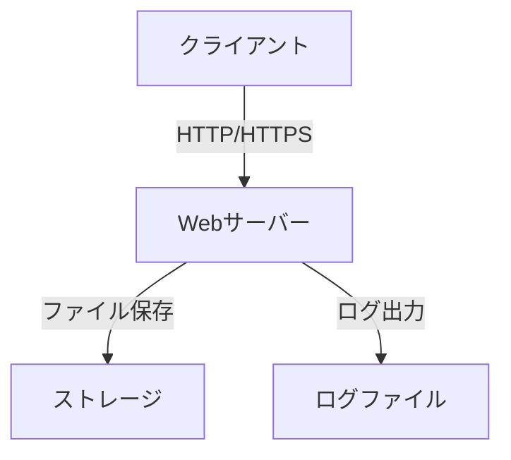
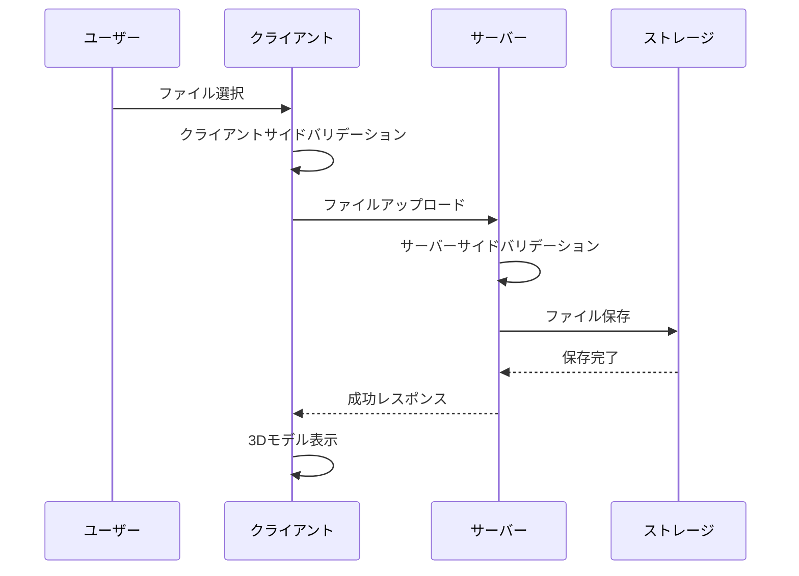

# 3Dモデルビューアー システム設計書

## 1. システムアーキテクチャ

### 1.1 全体構成


### 1.2 技術スタック
- **フロントエンド**
  - HTML5
  - CSS3（レスポンシブデザイン）
  - JavaScript（ES6+）
  - model-viewer（Googleの3Dレンダリングライブラリ）

- **バックエンド**
  - Node.js
  - Express.js（Webフレームワーク）
  - Multer（ファイルアップロード処理）

- **開発ツール**
  - Git（バージョン管理）
  - ESLint（コード品質管理）
  - Jest（テストフレームワーク）

## 2. ディレクトリ構成

```
model-viewer/
├── docs/
│   ├── requirement.md
│   └── design.md
├── src/
│   ├── public/
│   │   ├── css/
│   │   │   └── style.css
│   │   ├── js/
│   │   │   └── main.js
│   │   └── index.html
│   ├── server/
│   │   ├── config/
│   │   │   └── config.js
│   │   ├── middleware/
│   │   │   ├── fileValidator.js
│   │   │   └── errorHandler.js
│   │   ├── routes/
│   │   │   └── api.js
│   │   └── server.js
│   └── utils/
│       └── logger.js
├── tests/
│   ├── unit/
│   └── integration/
├── uploads/
├── package.json
└── README.md
```

## 3. コンポーネント設計

### 3.1 フロントエンド

#### 3.1.1 UIコンポーネント
- **ファイルアップロードエリア**
  - ドラッグ&ドロップ対応
  - ファイル選択ボタン
  - アップロード進捗表示

- **3Dモデルビューア**
  - model-viewerコンポーネント
  - 操作コントロール（回転、ズーム、パン）
  - カメラ位置リセットボタン

- **通知システム**
  - 成功/エラーメッセージ表示
  - ローディングインジケータ

#### 3.1.2 イベントハンドリング
```javascript
// メインイベントフロー
1. ファイル選択/ドロップ
2. バリデーション（クライアントサイド）
3. アップロードリクエスト送信
4. レスポンス待機
5. 3Dモデル表示/エラー表示
```

### 3.2 バックエンド

#### 3.2.1 APIエンドポイント
- **POST /api/upload**
  - マルチパートフォームデータ受信
  - ファイルバリデーション
  - ストレージへの保存
  - レスポンス返却

#### 3.2.2 ミドルウェア
- **fileValidator**
  - ファイル形式チェック（.glb）
  - ファイルサイズ制限
  - セキュリティチェック

- **errorHandler**
  - エラーログ記録
  - クライアントへのエラー通知

## 4. データフロー

### 4.1 ファイルアップロードフロー


## 5. セキュリティ設計

### 5.1 実装方針
- **入力検証**
  - ファイル拡張子の厳密なチェック
  - ファイルサイズの制限
  - MIMEタイプの検証

- **アップロード制限**
  - 同時アップロード数の制限
  - レート制限の実装
  - 一時ファイルの自動削除

### 5.2 エラーハンドリング
```javascript
try {
    // ファイル処理
} catch (error) {
    // エラーの種類に応じた処理
    switch (error.type) {
        case 'INVALID_FILE_TYPE':
        case 'FILE_TOO_LARGE':
        case 'UPLOAD_FAILED':
            // 適切なエラーメッセージを返す
    }
}
```

## 6. パフォーマンス最適化

### 6.1 実装方針
- **フロントエンド**
  - レスポンシブ画像の使用
  - 遅延ローディングの実装
  - キャッシュ戦略の適用

- **バックエンド**
  - ストリーミングアップロードの実装
  - 非同期処理の活用
  - キャッシュヘッダーの最適化

## 7. テスト計画

### 7.1 テスト項目
- **単体テスト**
  - ファイルバリデーション
  - エラーハンドリング
  - APIエンドポイント

- **統合テスト**
  - ファイルアップロードフロー
  - 3Dモデル表示機能
  - エラー通知システム

- **ブラウザ互換性テスト**
  - Chrome、Firefox、Safari、Edge
  - モバイルブラウザ対応

## 8. デプロイメント

### 8.1 必要環境
- Node.js 18.x以上
- npm 8.x以上
- 十分なストレージ容量

### 8.2 デプロイ手順
1. ソースコードのクローン
2. 依存パッケージのインストール
3. 環境変数の設定
4. ビルド実行
5. サーバー起動

## 9. 監視とログ

### 9.1 ログ設計
- **アプリケーションログ**
  - アクセスログ
  - エラーログ
  - パフォーマンスメトリクス

- **監視項目**
  - サーバーリソース使用率
  - アップロード成功率
  - レスポンスタイム 